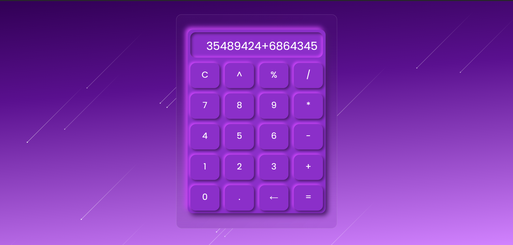

# Calculator App

A simple yet elegant Calculator project built using HTML, CSS, and JavaScript.

## [View Live](https://basharkhan7776.github.io/Calculator_App/) 

## Overview

This project is a simple yet powerful calculator application built using HTML, CSS, and JavaScript. The app provides a user-friendly interface for performing basic arithmetic operations like addition, subtraction, multiplication, and division. It is designed to be visually appealing and easy to use.

## Preview

https://github.com/user-attachments/assets/b8b495ed-5eb0-4382-ba66-3a22c23f936e

## Features

- Supports basic arithmetic operations: addition, subtraction, modulus, Power, multiplication, and division
- Clear and user-friendly interface
- Responsive design that works on various devices

## Screenshot

## Technical Details

- **HTML**: Used for structuring the calculator layout and buttons.
- **CSS**: Used for styling the calculator interface.
- **JavaScript**: Used for implementing the calculator logic and handling user input.

## License

This project is licensed under the MIT License. See `LICENSE` for details.

## Contributing

Contributions are welcome! If you'd like to contribute to this project, please fork the repository and submit a pull request.

## Acknowledgments

- Font: Poppins, courtesy of Google Fonts
- Logo:  
